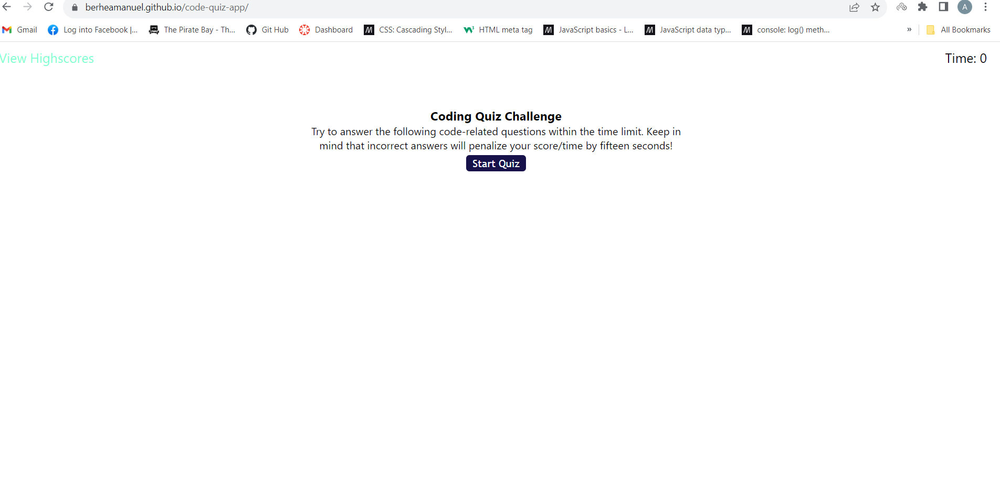
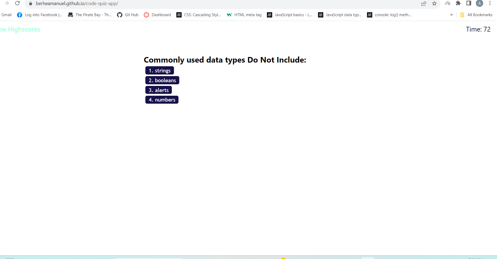

# Code Quiz

## Description
This application deployes multiple choice questions to asses programming skills.

## Deployed Link
* https://berheamanuel.github.io/code-quiz-app/

## User Story
* AS A coding boot camp student
* I WANT to take a timed quiz on JavaScript fundamentals that stores high scores
* SO THAT I can gauge my progress compared to my peers

## Acceptance Criteria
* GIVEN I am taking a code quiz
* WHEN I click the start button
* THEN a timer starts and I am presented with a question
* WHEN I answer a question
* THEN I am presented with another question
* WHEN I answer a question incorrectly
* THEN time is subtracted from the clock
* WHEN all questions are answered or the timer reaches 0
* THEN the game is over
* WHEN the game is over
* THEN I can save my initials and score

## Screenshot

## Technologies
 * HTML
 * CSS
 * Javascript

 ## References
* https://developer.mozilla.org/en-US/docs/Web/JavaScript/Reference/Global_Objects/Array/sort
* https://developer.mozilla.org/en-US/docs/Web/API
 ## License
 MIT